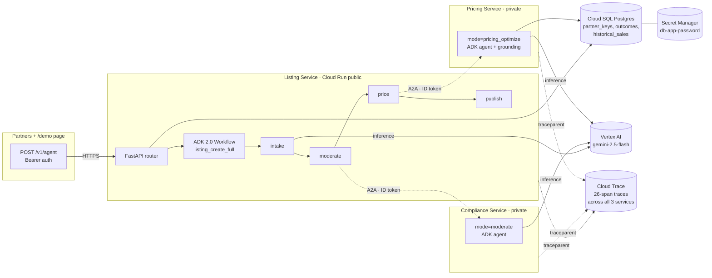

# SurplusAS Agent API — v2.0

Multi-agent production API for **SurplusAS**, a B2B surplus-food marketplace platform. v2.0 is a ground-up rebuild on **Google Cloud** (Cloud Run, Vertex AI Gemini, Cloud SQL Postgres) using Google's **Agent Development Kit (ADK) 2.0** and the **Agent-to-Agent (A2A)** protocol.

This rebuild is the SurplusAS submission to **Track 3 of the Google for Startups AI Agents Challenge** ("Refactor for Google Cloud Marketplace & Gemini Enterprise").

## Live demo

- Public merchant demo: <https://listing-service-70904707890.us-central1.run.app/demo>
- Public REST front door: `POST https://listing-service-70904707890.us-central1.run.app/v1/agent` (Bearer auth)
- API docs: <https://listing-service-70904707890.us-central1.run.app/docs>

## Architecture

Three Cloud Run services, one ADK 2.0 graph workflow, A2A between them, Cloud SQL behind:



- **Listing Service** (public, `allUsers`) — coordinator + intake / enhance / batch, search, customer assist, translate. The `listing_create_full` mode runs the ADK 2.0 graph workflow shown above.
- **Compliance Service** (private, IAM-only) — handles `moderate` over A2A.
- **Pricing Service** (private, IAM-only) — handles `pricing_optimize` over A2A; grounds on the `historical_sales` Cloud SQL table for demand-aware discount recommendations.
- **A2A auth** — every peer call mints a Google ID token whose audience matches the target service URL, cached per-audience for 50 minutes (`shared/a2a.py`).
- **Tracing** — `shared/tracing.py` registers a `CloudTraceSpanExporter` on each service and propagates W3C `traceparent`. A single `listing_create_full` request shows up in Cloud Trace as one trace with ~26 spans spanning all three services, with ADK's auto-instrumented `invoke_workflow`/`invoke_node`/`invoke_agent`/`call_llm` nested under our middleware spans.

Backward-compatible `POST /v1/agent` so v1.0 partners and the merchant demo don't have to change.

## Repo layout

```
shared/                     Common code: schemas, auth, db, A2A, tracing, prompts
services/listing/           Public service: FastAPI app, run_listing_mode dispatcher,
                            ADK 2.0 Workflow (pipeline.py), key-free /demo proxy
services/compliance/        Private service: moderate-only ADK agent + A2A endpoint
services/pricing/           Private service: pricing_optimize ADK agent + grounding
static/                     Merchant-demo HTML + WebP samples served from /demo
tests/                      pytest smoke suite hitting the deployed URL (Phase 6)
Dockerfile                  One image, switched between services via SERVICE_MODULE
TRACK3_MIGRATION_PLAN.md    Canonical migration plan
```

## Running locally

```bash
python -m venv .venv
.venv\Scripts\pip install -r requirements.txt
.venv\Scripts\pip install pytest

# Application Default Credentials (for Vertex AI + Cloud SQL Connector)
gcloud auth application-default login

# Run a single service locally
.venv\Scripts\uvicorn services.listing.api:app --port 8080 --reload
```

Environment variables (see `shared/config.py` for full list):

```
GOOGLE_CLOUD_PROJECT=ps2o-surplusas-api
GOOGLE_CLOUD_LOCATION=us-central1
LISTING_MODEL=gemini-2.5-flash
CLOUD_SQL_INSTANCE=ps2o-surplusas-api:us-central1:surplusas-db
DB_NAME=surplusas
DB_USER=surplusas_app
DB_PASSWORD=<from Secret Manager db-app-password>
COMPLIANCE_SERVICE_URL=https://compliance-service-...
PRICING_SERVICE_URL=https://pricing-service-...
```

## Smoke tests

`tests/smoke_test_modes.py` hits the deployed Cloud Run URL with a fixture per mode and asserts response shapes. Slow (~30s/test, real LLM calls) but the only thing that catches Vertex AI prompt-format drift end-to-end.

```bash
.venv\Scripts\pytest tests/                               # all modes
.venv\Scripts\pytest tests/ -k pricing_optimize -v        # one mode
SURPLUSAS_BASE_URL=https://other-service.run.app pytest tests/
```

## Deploy

Deploys go through Cloud Build via `gcloud run deploy --source .`. The same image is reused for all three services — only `SERVICE_MODULE` differs:

```bash
gcloud run deploy listing-service    --source . --update-env-vars SERVICE_MODULE=services.listing.api    ...
gcloud run deploy compliance-service --source . --update-env-vars SERVICE_MODULE=services.compliance.api ...
gcloud run deploy pricing-service    --source . --update-env-vars SERVICE_MODULE=services.pricing.api    ...
```

**Always** use `--update-env-vars` (additive) rather than `--set-env-vars` (full replacement) — the latter wipes `CLOUD_SQL_INSTANCE` and friends.

## Status

🟢 **Phases 1–5 complete.** Three services deployed, A2A tested, ADK 2.0 graph workflow running end-to-end, multi-service Cloud Trace correlation verified, pricing grounding firing.

🚧 **Phase 6** — smoke tests in this repo, README polish (this commit).

⏳ **Phase 7** — Devpost submission, 2-min demo video.

See [`TRACK3_MIGRATION_PLAN.md`](./TRACK3_MIGRATION_PLAN.md) for the full plan, phase status, risks, and verification steps.

## License

[MIT](./LICENSE).
